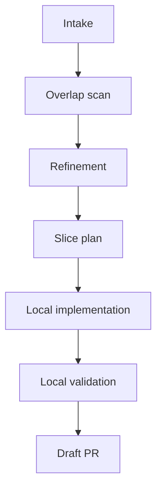
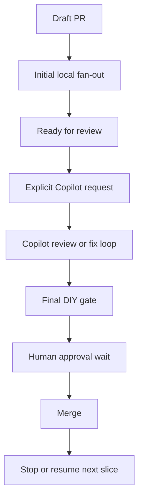

# Conductor loops
## Reduce delivery latency by owning waiting states

The biggest waste in software delivery is often the gap between one state change and the next action.

---
layout: section
---

# Executive summary
## The value is faster flow, not AI theater

---

# The company problem

Teams lose time in routine gaps such as:
- review arrived, nobody resumed
- CI turned green, PR stayed idle
- obvious remediation existed, but the loop stalled
- approval happened, the next slice did not start

These delays are usually coordination delays.
They accumulate into slower delivery.

---

# Why this matters to the business

Small waiting gaps compound into:
- longer cycle time
- more idle PR time
- more interrupted focus
- slower feedback loops
- lower throughput without better quality

The company cost is not one missed transition.
The cost is hundreds of missed transitions.

---

# What changes with a conductor

A conductor owns the workflow between steps.

It keeps track of:
- the current state
- the next safe transition
- active waits
- who or what is blocking progress
- when to resume automatically

That turns waiting from passive delay into an owned state.

---

# Human attention goes where it matters most

Humans stay focused on:
- architecture
- PRD and requirement shaping
- acceptance criteria and definition of done
- manual testing and exploratory validation
- risk and tradeoff decisions
- final approval and accountability

The conductor owns the predictable coordination work around those decisions.

---
layout: section
---

# The core mechanism
## A deterministic state machine

---

# Why the state machine is central

The state machine is the control surface.

It makes the workflow:
- visible
- inspectable
- resumable
- testable
- optimizable

Without it, teams fall back to memory, polling, and manual babysitting.

---

# Full workflow at a glance

1. intake and overlap scan
2. issue refinement and shaping
3. bounded slice planning
4. local implementation
5. draft PR
6. initial local fan-out review
7. ready-for-review transition
8. explicit Copilot request and review loop
9. final DIY DRY/KISS/YAGNI gate
10. human approval wait
11. merge
12. stop or resume the next slice

Waiting states remain part of the workflow.

---

# Draft-stage review gate

Use the initial local fan-out for:
- scope fit
- SRP / cohesion / boundaries
- acceptance criteria
- definition of done
- architecture fit
- test adequacy

Goal: confirm this is the right PR before it moves forward.

---

# Final review gate

Use the last local fan-out for:
- DRY
- KISS
- YAGNI

Goal: remove avoidable complexity before approval.

---

# Example flow: from idea to local execution

The conductor owns this path so the team does not lose time between shaping, implementation, and the first PR state.

---

# Example flow: from PR to closeout

The main value is simple: every waiting state stays owned until the next action happens.

---

# Deterministic tooling needed

To make this trustworthy, the system needs:
- explicit state transitions
- live conductor plus watcher ownership
- draft / ready / Copilot / approval / merge transitions
- visible PR-side state comments
- durable local state and closeout artifacts
- terminal vs resumable merge logic
- mid-flight steering and safe-point behavior
- reliable latest-turn grounding for operator control

This is what turns the pattern into infrastructure instead of ceremony.

---
layout: section
---

# Why this could be a company-scale gain
## The win is latency compression

---

# Expected impact

A conductor-led model should reduce:
- passive delay after state changes
- dropped handoffs
- stale PRs waiting for obvious next actions
- human polling and status babysitting
- context reload overhead between steps

That should improve:
- throughput
- review responsiveness
- slice-to-slice flow
- developer focus

---

# Rollout path

Start with bounded slices on real work.

- one conductor
- bounded workers
- explicit refinement and review gates
- visible PR-side state updates
- human approval retained
- deterministic closeout artifacts

That gives the company faster flow without giving up control.

---
layout: end
---

# Bottom line

The opportunity is simple:

## cut the dead time between one state change and the next action

That gives people more time for architecture, requirements, validation, and judgment.
