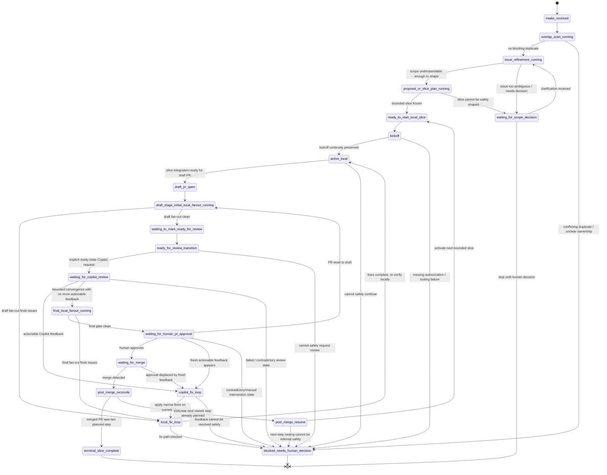

# Conductor loops
## Reduce delivery latency by owning waiting states

The biggest waste is usually the gap between one state change and the next action.

---
layout: section
---

# The problem
## Teams lose hours in the gaps between obvious next steps

---

# Where the time goes

- review landed, nobody resumed
- CI turned green, PR stayed idle
- obvious fix, loop stalled
- draft was ready, transition never happened
- approval happened, next slice never started

The delay is rarely hard work.
The delay is usually missed state change.

---

# The hidden tax

- waiting
- noticing too late
- reloading context
- pushing the next routine transition by hand

Small gaps stack up.
Across many PRs, they become lead time.

---
layout: section
---

# The core idea
## The state machine is the product

---

# Why the state machine matters

A conductor loop works only when the workflow is explicit.

- visible states
- deterministic transitions
- owned waits
- known next safe action

That is the real product surface.

---

# What the conductor owns

- state transitions
- waiting-state monitoring
- review choreography
- resume / attach / continue decisions
- PR and tracker state projection
- stop vs resume after merge

Workers stay bounded.
The conductor keeps orchestration truth.

---

# What humans should own

- architecture
- PRD and requirement shaping
- acceptance criteria and DoD
- manual testing
- business tradeoffs
- final approval

Human time should go to judgment, not babysitting.

---
layout: section
---

# Full walkthrough
## The loop starts before coding and ends after closeout

---

# Full workflow

1. intake and overlap scan
2. issue refinement and shaping
3. bounded slice planning
4. local implementation
5. draft PR
6. initial local fan-out
7. ready-for-review transition
8. explicit Copilot request and review loop
9. final DIY DRY/KISS/YAGNI gate
10. human approval wait
11. merge
12. stop or resume next slice

Treat waiting states as real states.

---

# Loops inside the loop

- refinement loop
- slice-shaping loop
- local implementation loop
- draft-stage review loop
- Copilot review/fix loop
- final DIY approval loop
- merge / closeout / resume loop

The state machine tells us which loop is active and what ends it.

---

# Draft-stage gate

Use the first local fan-out for:
- SRP / cohesion / boundaries
- scope fit
- AC compliance
- DoD compliance
- architecture fit
- test adequacy

Goal: decide whether this is the right PR.

---

# Ready-state Copilot gate

When the PR becomes ready:
- request or confirm Copilot review
- enter the Copilot review state
- fix, validate, push, and re-request if needed
- repeat until convergence

Ready-for-review is a real workflow transition.

---

# Final approval gate

After Copilot converges:
- run DRY
- run KISS
- run YAGNI
- fix if needed
- then wait for human approval

This is the last local quality gate before approval.

---

# Full conductor state machine

---

# Deterministic tooling required

- explicit conductor states and transitions
- refinement and shaping transitions
- draft / ready / Copilot / approval / merge transitions
- live conductor plus watcher ownership
- visible PR comments on local state changes
- durable local state and closeout artifacts
- terminal vs resumable merge behavior
- mid-flight steering and safe points
- reliable latest-turn grounding

Without these, the loop is fragile.

---
layout: section
---

# Why this matters in a company
## The gain is latency compression

---

# Company-scale impact

In a company setting:
- more PRs
- more reviewers
- more queues
- more context switching
- more missed transitions

A conductor cuts the latency tax after each state change.

---

# The actual pitch

Use this framing:
- humans focus on architecture, requirements, testing, and approval
- the conductor owns predictable coordination work
- the state machine removes idle time between steps

That is the value story.

---

# Pilot evidence already helps

The pilot already exposed concrete gaps:
- kickoff created owned state but did not stay live
- watcher-only ownership was not enough
- draft / ready / approval states were misclassified
- mandatory review gates were skipped
- merge handling lacked clear stop vs resume rules
- post-merge visibility varied by slice
- latest-turn grounding failed in the operator layer

That evidence is useful because it is specific.

---

# Rollout idea

Start with bounded slices on real work.

- one conductor
- bounded workers
- explicit refinement and review gates
- visible PR-side state comments
- manual approval retained
- deterministic closeout artifacts

First target: trustworthy ownership and fast resume.

---
layout: end
---

# Bottom line

The goal is simple:

## cut the dead time between one state change and the next action

That gives developers more time for the work only humans should do.
