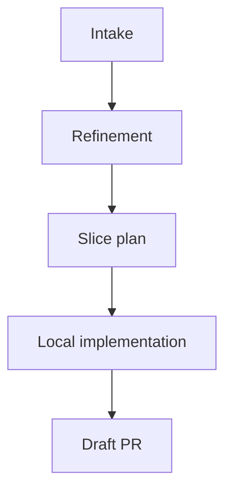
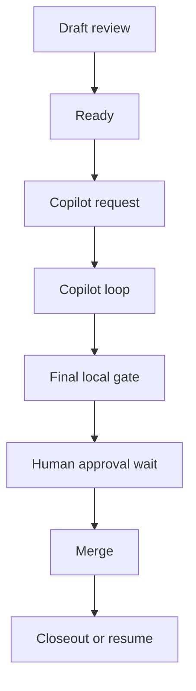

  

    

      
pi-dev-loops · leadership brief

      <h1>Notice <em>latency</em>.</h1>
      <h2>The slow edge in delivery often starts after the work is already done.</h2>
      

        A PR changes state. A review arrives. CI turns green. Approval lands. Then the work waits for someone to notice.
      

      

        state machine
        owned waiting states
        review loops
        human approval
      

    

    

      

        
Core claim

        
Calendar time disappears in the gap between a signal firing and the next action.

      

      

        
Proposal

        
Let a conductor process carry work between states while people keep the decisions.

      

    

  

---
layout: section
---

  
Opening case

  <h1>Where delivery time goes</h1>
  
Most calendar time disappears after a state change and before the next human action.

---

# A normal PR burns time in the gaps

  

    An engineer opens a PR at 10:00. A review lands at 11:14. The author sees it at 14:28.
  

  

    None of that delay came from architecture, implementation, or review quality. The work sat in a notification queue.
  

  

    
Signals

    <ul class="tight-list">
      <li>review posted</li>
      <li>CI passed</li>
      <li>approval granted</li>
      <li>merge possible</li>
    </ul>
  

  

    
Observed delay

    <ul class="tight-list">
      <li>waiting for the author to notice</li>
      <li>waiting for CI to be checked</li>
      <li>waiting for somebody to merge</li>
      <li>waiting for tracker closeout</li>
    </ul>
  

---

  

  <blockquote>Humans don’t subscribe to events. We poll.</blockquote>
  
Why latency shows up in every queue

  A pipeline can be event-driven. The consumer of those events is still a person checking tabs, notifications, and CI dashboards in batches.

---

# What is pi-dev-loops?

  
Repository framing

  
A repository for reusable development loops.

  <ul>
    <li>deterministic tooling</li>
    <li>workflow skills</li>
    <li>review and control surfaces</li>
    <li>conductor-led orchestration</li>
  </ul>
  

    The repo turns delivery loops into something visible, resumable, and improvable.
  

---
layout: section
---

  
Operating model

  <h1>The conductor carries work between decisions</h1>
  
Judgment stays with people. Coordination follows the state machine.

---

# Coordination belongs in the middle lane

  

    
Conductor lane

    <h3>Mechanical work</h3>
    <ul>
      <li>listen for state transitions</li>
      <li>own the review, CI, and approval waits</li>
      <li>post visible status updates</li>
      <li>route the next loop</li>
      <li>advance tracker state after merge</li>
    </ul>
  

  

    
Human lane

    <h3>Judgment work</h3>
    <ul>
      <li>requirements and acceptance criteria</li>
      <li>architecture and tradeoffs</li>
      <li>review comments and approval</li>
      <li>manual validation</li>
      <li>final merge decision</li>
    </ul>
  

  Ambiguity at that line is a design bug.

---

# The loop set

  
Loop architecture

  <ul class="tight-list">
    <li>refinement</li>
    <li>slice shaping</li>
    <li>local implementation</li>
    <li>draft review</li>
    <li>Copilot review and fix</li>
    <li>final local approval</li>
    <li>closeout or resume</li>
  </ul>
  

    Each loop solves one delivery problem. The conductor keeps the chain moving.
  

---

# Figure 1 · intake to draft PR

  Figure 1
  The first half turns raw work into a bounded slice that can enter formal review.

---

# Figure 2 · draft PR to shipped work

  Figure 2
  The second half carries work across the waits that usually vanish into calendar time.

---

# Review gates answer different questions

  

    
Early gate

    <h3>Should this PR exist?</h3>
    <ul>
      <li>scope fit</li>
      <li>SRP and boundaries</li>
      <li>AC and DoD coverage</li>
      <li>architecture fit</li>
      <li>test adequacy</li>
    </ul>
  

  

    
Final gate

    <h3>Should this ship now?</h3>
    <ul>
      <li>DRY</li>
      <li>KISS</li>
      <li>YAGNI</li>
    </ul>
  

---

# Deterministic tooling keeps the loop trustworthy

  
Required capabilities

  <ul>
    <li>explicit states and transitions</li>
    <li>live ownership through waits</li>
    <li>visible PR-side state updates</li>
    <li>durable local state and closeout artifacts</li>
    <li>stop versus resume rules after merge</li>
    <li>mid-flight operator steering</li>
  </ul>

---
layout: section
---

  
Business view

  <h1>Leadership gets time back at scale</h1>
  
The win shows up as lower queueing cost, cleaner handoffs, and faster cycle time.

---

# Company impact

  

    
Costs reduced

    <ul>
      <li>idle PR time</li>
      <li>dropped handoffs</li>
      <li>delayed resumes after reviews and CI</li>
      <li>manual status polling</li>
      <li>context reload overhead</li>
    </ul>
  

  

    
Expected gains

    <ul>
      <li>shorter cycle time</li>
      <li>higher throughput</li>
      <li>faster review response</li>
      <li>better developer focus</li>
      <li>more predictable delivery</li>
    </ul>
  

---

# Tracker-first hybrid loop

  

    
Tracker side

    <h3>Planning truth</h3>
    <ul>
      <li>priority and dependency context</li>
      <li>status truth</li>
      <li>next bounded slice</li>
      <li>portfolio visibility</li>
    </ul>
  

  

    
Execution side

    <h3>Shipping loop</h3>
    <ul>
      <li>local worktrees handle implementation</li>
      <li>PRs handle review and merge</li>
      <li>merge updates tracker state</li>
      <li>the process resumes from the next tracker state</li>
    </ul>
  

---

# Non-goals keep the design credible

  

    
Out of scope

    <ul>
      <li>removing humans from review</li>
      <li>merging without approval</li>
      <li>pretending judgment can be automated away</li>
      <li>selling velocity claims before the data exists</li>
    </ul>
  

  

    
In scope

    <ul>
      <li>own the waits</li>
      <li>advance work the moment a state ends</li>
      <li>leave a visible audit trail</li>
      <li>keep a clean kill switch</li>
    </ul>
  

---

  

  <blockquote>Tooling that hears state transitions for us gives people back the time they came to spend on judgment.</blockquote>
  
What the investment buys

---
layout: end
---

  
Bottom line

  <h1>Cut the dead time between one state change and the next action.</h1>
  
Spend the recovered time on requirements, architecture, validation, and decisions that still need a person.

