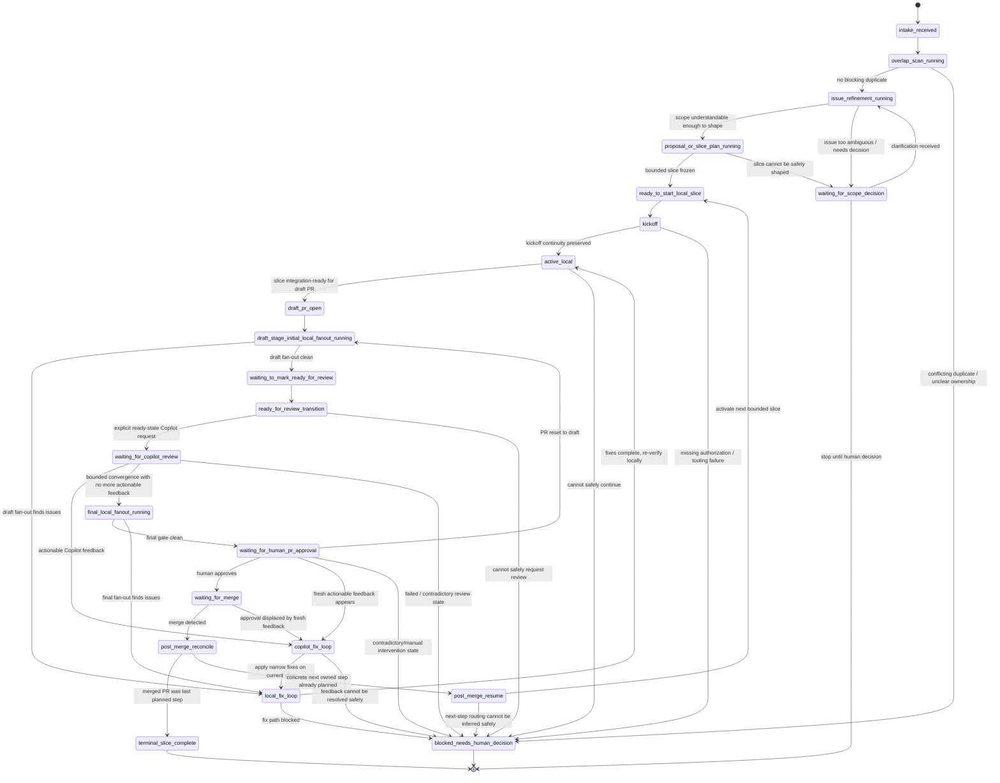

# Conductor loops
## Reduce delivery latency by owning waiting states

The biggest waste is often not implementation effort. It is the dead time between state changes and the next action.

---
layout: section
---

# The problem
## Teams lose hours in the gaps between obvious next steps

---

# The real problem

A lot of delivery time disappears after the hard part is already done.

The next step is often obvious. The delay comes from noticing the state change too late and resuming too slowly.

Examples:
- a review landed, but nobody resumed for hours
- CI turned green, but the PR stayed idle
- a fix was obvious, but the remediation loop stalled
- a draft was ready, but the ready-state transition never happened
- an approval happened, but the next slice did not start

---

# The hidden tax is waiting

The expensive part is often:
- waiting
- missing that waiting is over
- reloading context after idle gaps
- manually pushing the next predictable transition

Each delay looks small on its own.

Across many PRs, reviews, and loops, it turns into:
- slower throughput
- more interrupted focus
- more stale work
- longer lead time with no real quality gain

---
layout: section
---

# The core idea
## The state machine is the product

---

# The state machine is the core product

The key move is to model the workflow explicitly as states and transitions.

That means:
- states are visible
- transitions are deterministic
- waits remain owned
- the loop knows the next safe action

Without a state machine, the workflow depends on:
- memory
- prompt conventions
- manual babysitting
- hidden handoff gaps

With a state machine, the workflow becomes:
- inspectable
- resumable
- testable
- improvable

---

# What the conductor should own

The conductor should own:
- state transitions
- waiting-state monitoring
- deterministic review choreography
- resume / attach / continue decisions
- visible state projection back to PRs and trackers
- safe stop vs resume decisions after merge

Workers stay bounded.

The conductor keeps the orchestration truth.

---

# Human work becomes more valuable

Humans should spend attention where judgment matters most:
- architecture
- PRD and requirement shaping
- acceptance criteria and definition of done
- manual testing and exploratory validation
- business tradeoffs
- final approval and accountability gates

Humans should not spend most of their time on:
- polling status
- re-requesting predictable transitions
- watching CI turn green
- noticing routine review-state changes
- babysitting loops that already know the next step

---
layout: section
---

# Full walkthrough
## The conductor loop starts before coding and ends after merge closeout

---

# Full workflow walkthrough

The conductor-led pattern should cover the whole path:

1. intake and overlap scan
2. issue refinement and shaping
3. bounded slice planning
4. local implementation
5. draft PR
6. initial local fan-out review
7. ready-for-review transition
8. explicit Copilot request and review loop
9. final DIY DRY/KISS/YAGNI gate
10. human approval wait
11. merge
12. stop or resume the next slice

Treat waiting states as real states, not as invisible idle time.

---

# The loops inside the loop

The conductor is not one flat flow.

It coordinates multiple nested loops:
- refinement loop
- slice-shaping loop
- local implementation loop
- draft-stage review loop
- Copilot review/fix loop
- final DIY approval loop
- merge / closeout / resume loop

The state machine matters because it tells us:
- which loop is active now
- what event ends that loop
- where work returns next

---

# Review choreography matters

Two local fan-out gates do different jobs.

## Initial draft-stage fan-out
Focus on:
- SRP / cohesion / boundary quality
- issue scope fit
- AC compliance
- DoD compliance
- architecture fit
- test adequacy

## Final pre-approval fan-out
Focus on:
- DRY
- KISS
- YAGNI

The gate order matters.

---

# Full conductor state machine

---

# Deterministic tooling we need

To make this trustworthy, the loop needs deterministic tooling for:
- explicit conductor states and transitions
- intake / refinement / shaping transitions
- draft / ready / Copilot / approval / merge transitions
- live conductor plus watcher ownership
- visible PR comments on meaningful local state changes
- durable local state and closeout artifacts
- terminal vs resumable merge decisions
- mid-flight steering and safe-point handling
- reliable latest-turn / active-question grounding

Without these pieces, the loop looks autonomous but is not actually reliable.

---
layout: section
---

# Why this matters in a company
## The gain is latency compression, not AI theater

---

# Why this matters in a company

In a company setting, people context-switch constantly.

That makes missed state changes far more expensive:
- more PRs in flight
- more reviewers
- more queues
- more partial waits
- more delays between a state change and the next obvious action

A conductor reduces that latency tax.

That can produce:
- shorter cycle time
- less idle PR time
- fewer dropped handoffs
- better developer focus

---

# The presentation point

This should not be framed as:
- “look, we built a clever AI loop.”

It should be framed as:
- the system cuts passive delay after state changes
- humans focus on architecture, requirements, testing, and approval
- the conductor owns predictable coordination work

That is the real business value.

---

# Pilot evidence already shows the shape

The live pilot already exposed concrete orchestration gaps:
- kickoff that created owned state but did not stay live
- watcher-only ownership not being enough
- stale or wrong state classification across draft / ready / approval transitions
- missing mandatory review gates
- merge detection without clear terminal vs resumable semantics
- weak post-merge visibility in some slices
- latest-turn grounding failures in the operator conversation layer

That is useful evidence.
It means the missing pieces are now concrete and fixable.

---

# Practical rollout idea

Start with bounded slices and prove the loop on real work:
- one conductor
- bounded workers
- explicit refinement and review gates
- visible PR-side state comments
- manual approval retained
- deterministic closeout artifacts

Do not chase magic autonomy first.

Aim for:
- trustworthy state ownership
- reliable waiting-state handling
- faster resume after every state change
- a state machine that can be inspected and improved over time

---
layout: end
---

# Bottom line

The goal is to eliminate the dead time between implementation steps.

If we do that well:
- developers focus on the work only humans should do
- the conductor owns predictable coordination work
- delivery gets faster without lowering quality

## The biggest win is cutting latency between state changes.
