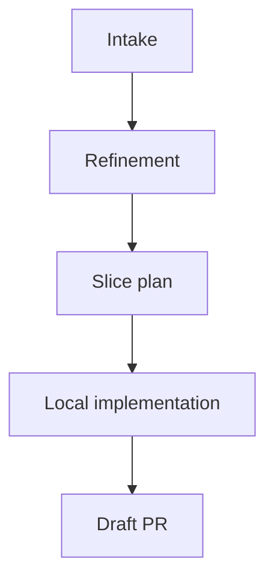
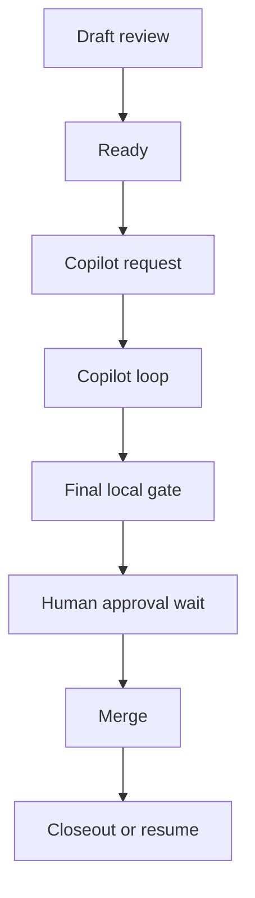

  

    

      
Stakeholder presentation

      <h1>A state-machine-driven shipping process</h1>
      <h2>Reduce delivery latency by owning the work between steps</h2>
      

        The biggest waste in software delivery is often the gap between one state change and the next action.
      

      

        state machine
        owned waiting states
        review loops
        human approval gates
      

    

    

      

        
Main claim

        
Compress the delay between state change and next action.

      

      

        
Operating model

        
A conductor-linked chain of loops from intake through merge.

      

    

  

---
layout: section
---

  
Opening case

  <h1>Why this matters</h1>
  
Faster shipping through owned waiting states.

---

# The company problem

Teams lose hours in routine gaps such as:
- review arrived, nobody resumed
- CI turned green, PR stayed idle
- a fix was clear, but the loop stalled
- approval happened, the next slice never started

Those gaps look small. Across a company, they become a large delivery tax.

---

# What is pi-dev-loops?

Repository framing

`pi-dev-loops` is a repository for reusable development loops.

It combines:
- deterministic tooling
- workflow skills
- review and control surfaces
- conductor-led orchestration

It exists to move work from intake to shipped outcome with a process that stays visible, resumable, and improvable.

---

# The core concept

Shipping model

Think of this as a **shipping process** built from explicit loops:
- refinement loops
- shaping loops
- implementation loops
- review and fix loops
- approval and closeout loops

The conductor keeps those loops connected. The shipping process is the product.

---

# Process ownership and human ownership

Process ownership

- intake and shaping
- local implementation flow
- review choreography
- waiting-state monitoring
- resume and continue decisions
- merge closeout and next-step routing

Human ownership

- architecture
- PRD and requirement shaping
- acceptance criteria and definition of done
- manual testing and exploratory validation
- business tradeoffs
- final approval and accountability

The process carries predictable coordination work so people can focus on judgment.

---
layout: section
---

  
Operating model

  <h1>The required loops</h1>
  
Shipping work means guiding it through the right loops at the right time.

---

# The loop architecture

Loop set

A real shipping process needs multiple loops:
- refinement
- shaping
- implementation
- draft review
- Copilot review and fix
- final approval
- closeout or resume

Each loop solves a different delivery problem. The conductor keeps them connected.

---

# Flow 1: from intake to draft PR

This first half turns raw work into a bounded slice that is ready for formal review.

---

# Flow 2: from draft PR to shipped work

The full operating model is a chain of loops rather than one flat automation step.

---

# Waiting states are the real bottleneck

Most wasted time comes from the gaps around active work.

Typical waiting states:
- review waiting
- CI waiting
- approval waiting
- waiting for somebody to notice the state change

Owning those states is where the speedup comes from.

---

# Review choreography matters

Early review loop

- scope fit
- SRP / boundaries
- AC and DoD coverage
- architecture fit
- test adequacy

Final review loop

- DRY
- KISS
- YAGNI

Different loops answer different questions.

---

# Deterministic tooling is what makes it trustworthy

The system needs deterministic tooling for:
- explicit states and transitions
- draft / ready / review / approval / merge transitions
- live ownership through waits
- visible PR-side state updates
- durable local state and closeout artifacts
- stop versus resume decisions after merge
- mid-flight steering

Without that, the process may look autonomous while staying unreliable.

---
layout: section
---

  
Business view

  <h1>Why this matters in a company</h1>
  
The win is latency compression at scale.

---

# Company impact

Costs reduced

- idle PR time
- dropped handoffs
- delayed resumes after reviews and CI
- context reload overhead
- manual status polling

Expected gains

- shorter cycle time
- higher throughput
- faster review response
- better developer focus
- more predictable delivery

---

# Tracker-first hybrid model

Tracker side

- planning truth
- status truth
- priority and dependency context
- next bounded slice

Execution side

- local worktrees handle implementation
- PRs handle review and merge
- merge updates tracker state
- the process resumes from tracker state

That keeps planning, execution, and review connected.

---

# Why this differs from generic AI automation

The real target is the dead time around judgment.

Judgment stays with people. The process removes the waiting around those decisions.

That means:
- humans spend more time deciding
- less time polling, nudging, and babysitting
- the process keeps work moving between meaningful decisions

---

# Practical rollout

Start with bounded slices on real work.

- one conductor
- bounded workers
- explicit loops and review gates
- visible PR-side state comments
- manual approval retained
- deterministic closeout artifacts

The first goal is trustworthy flow through the loops. Magic autonomy can wait.

---
layout: end
---

# Bottom line

Bottom line

## cut the dead time between one state change and the next action

That gives people more time for architecture, requirements, validation, and judgment.

