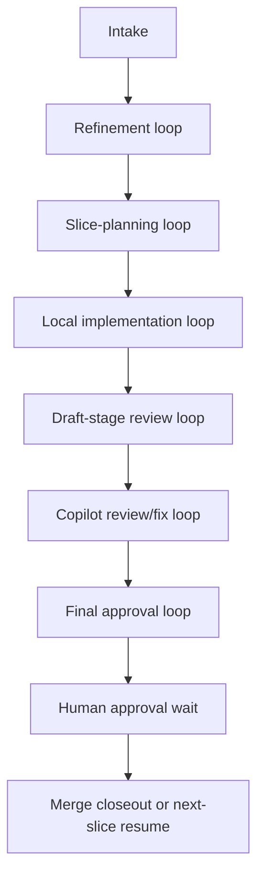

# A state-machine-driven shipping process
## Reduce delivery latency by owning the work between steps

The biggest waste in software delivery is often the gap between one state change and the next action.

---
layout: section
---

# Executive summary
## The value is faster shipping, not more workflow theater

---

# The company problem

Teams lose hours in routine gaps such as:
- review arrived, nobody resumed
- CI turned green, PR stayed idle
- a fix was clear, but the loop stalled
- approval happened, the next slice never started

Those gaps look small.
Across a company, they become a large delivery tax.

---

# What this actually is

This is bigger than a coordinator bot.

The core idea is a **shipping process** built from explicit loops that move work forward:
- refinement loops
- shaping loops
- implementation loops
- review and fix loops
- approval and closeout loops

The conductor keeps those loops connected.
The process is the real product.

---

# What the process owns

A shipping process should own:
- intake and shaping
- local implementation flow
- review choreography
- waiting-state monitoring
- resume and continue decisions
- merge closeout and next-step routing

That is how work keeps moving without constant babysitting.

---

# What humans should own

Humans stay focused on work that needs judgment:
- architecture
- PRD and requirement shaping
- acceptance criteria and definition of done
- manual testing and exploratory validation
- business tradeoffs
- final approval and accountability

The process owns the predictable coordination work around those points.

---
layout: section
---

# The required loops
## Shipping work means guiding it through the right loops at the right time

---

# The loop architecture

A real shipping process needs multiple loops:
- refinement loop
- slice-shaping loop
- local implementation loop
- draft-stage review loop
- Copilot review and fix loop
- final local approval loop
- merge closeout or resume loop

Each loop solves a different delivery problem.
The conductor keeps them connected.

---

# End-to-end view

This is the operating model: a chain of loops, not one flat automation step.

---

# Waiting states are the real bottleneck

The process matters because most wasted time is not active work.

It is time spent in states like:
- waiting for review
- waiting for CI
- waiting for approval
- waiting for somebody to notice that waiting is over

Owning those states is where the speedup comes from.

---

# Review choreography matters

The process uses different review loops for different questions.

## Early review loop
- scope fit
- SRP / boundaries
- AC and DoD coverage
- architecture fit
- test adequacy

## Final review loop
- DRY
- KISS
- YAGNI

That separation keeps the flow disciplined.

---

# Deterministic tooling is what makes it trustworthy

The system needs deterministic tooling for:
- explicit states and transitions
- draft / ready / review / approval / merge transitions
- live ownership through waits
- visible PR-side state updates
- durable local state and closeout artifacts
- stop versus resume decisions after merge
- mid-flight steering

Without that, the process looks autonomous but is not reliable.

---
layout: section
---

# Why this matters in a company
## The win is latency compression at scale

---

# Company impact

A company-scale process like this should reduce:
- idle PR time
- dropped handoffs
- delayed resumes after reviews and CI
- context reload overhead
- manual status polling

That should improve:
- cycle time
- throughput
- review responsiveness
- developer focus
- predictability of delivery

---

# Tracker-first hybrid model

In a company, this usually becomes a **tracker-first hybrid loop**:
- tracker holds planning and status truth
- local worktrees handle implementation
- PRs handle review and merge
- merge updates tracker state
- the process continues from the tracker state

That is how planning, execution, and review stay connected.

---

# Why this is different from generic AI automation

The point is not to automate judgment.

The point is to automate the dead time around judgment.

That means:
- humans spend more time deciding
- less time polling, nudging, and babysitting
- the process keeps work moving between meaningful decisions

---

# Practical rollout

Start with bounded slices on real work.

- one conductor
- bounded workers
- explicit loops and review gates
- visible PR-side state comments
- manual approval retained
- deterministic closeout artifacts

The first goal is not magic autonomy.
The first goal is trustworthy flow through the loops.

---
layout: end
---

# Bottom line

The opportunity is simple:

## cut the dead time between one state change and the next action

That gives people more time for architecture, requirements, validation, and judgment.
