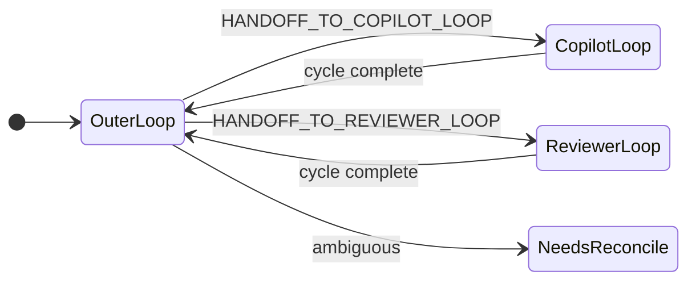
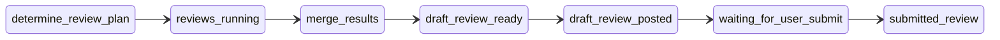

  
pi-dev-loops

  <h1>Eliminating Coordination Delay in AI-Assisted Dev Workflows</h1>
  
A coordination runtime built on nested state machines. Every handoff is explicit, routed, and observable.

---

Design Approach

## State Graphs and Pure Functions, Not Prompt Engineering

<ul class="tight-list">
  <li>Workflow logic lives in <strong>skills</strong> backed by deterministic state machines</li>
  <li>Routing, gating, and handoff are pure functions — testable, reproducible</li>
  <li>LLM judgment is bounded: the graph decides <em>what happens next</em>, the agent decides <em>how</em></li>
</ul>

<ul class="tight-list">
  <li><strong>Prompt-only approach</strong>: behavior drifts with model updates, context length, temperature</li>
  <li><strong>Graph-backed skills</strong>: transitions are closed sets, outcomes are enumerable, regressions are catchable in CI</li>
</ul>

---

Loop Model

## Three Nested Loops, Closed Transition Sets

<ul class="tight-list">
  <li><strong>Outer loop</strong> — selects one <code>ROUTING_OUTCOME</code> per cycle</li>
  <li><strong>Copilot loop</strong> — explicit lifecycle states from <code>no_pr</code> to <code>done</code>, including <code>pr_ready_no_feedback</code>, <code>waiting_for_copilot_review</code>, and <code>blocked_needs_user_decision</code></li>
  <li><strong>Reviewer loop</strong> — feedback resolution and re-request</li>
  <li>Ambiguity yields <code>needs_reconcile</code>, never a guessed handoff</li>
</ul>

---

Quality Gates

## Every State Transition Is an Explicit Gate

<ul class="tight-list">
  <li><code>no_pr → pr_draft</code> — work exists but is not reviewable</li>
  <li><code>pr_draft → pr_ready_no_feedback</code> — author signals readiness</li>
  <li><code>pr_ready_no_feedback → waiting_for_copilot_review</code> — review requested</li>
  <li><code>stop_at_next_safe_gate</code> requests a stop that takes effect at the next safe gate</li>
</ul>

<strong>SAFE_POINT_CATEGORY</strong>

  immediate
  next_point
  terminal

Each copilot-loop state maps to a safe-point category — the loop knows where it can safely pause for operator input.

---

Conductor Routing

## evaluateConductorRouting: One Deterministic Outcome Per Cycle

<ul class="tight-list">
  <li>Pure function — no I/O, no side effects</li>
  <li>Consumes family-local lifecycle states as inputs</li>
  <li>Returns exactly one <code>ROUTING_OUTCOME</code></li>
  <li>Conflicting signals → <code>needs_reconcile</code>, never a guess</li>
</ul>

<strong>ROUTING_OUTCOME</strong>

  continue_current_wait
  handoff_to_copilot_loop
  handoff_to_reviewer_loop
  stay_with_current_live_owner
  stop_needs_human
  done_terminal
  needs_reconcile

---

Parallel Reviews

## Fan-Out Review Angles, Merge Into One Coherent Package

<ul class="tight-list">
  <li><code>determine_review_plan</code> — select bounded review angles</li>
  <li><code>reviews_running</code> — parallel local runs per angle</li>
  <li><code>merge_results</code> — combine findings into one review</li>
  <li><code>draft_review_ready</code> → <code>draft_review_posted</code> → <code>waiting_for_user_submit</code> → <code>submitted_review</code></li>
</ul>

---

Steering

## Operators Inject Constraints Mid-Flight Without Breaking the Loop

<ul class="tight-list">
  <li><code>stop_at_next_safe_gate</code> — requests a stop at the next safe gate</li>
  <li><code>hard_constraint</code> — must be respected by subsequent steps</li>
  <li><code>preference</code> / <code>clarification</code> — softer guidance</li>
  <li><code>next_point</code> states queue unsafe-now events; terminal states reject or require human action</li>
</ul>

<strong>STEERING_KIND</strong>

  hard_constraint
  preference
  clarification
  stop_at_next_safe_gate

Result: <code>applied_now</code> · <code>queued_for_safe_point</code> · <code>rejected_unsafe_now</code> · <code>rejected_invalid_or_conflicting</code> · <code>needs_human_decision</code>

---

PR Projection

## PRs Announce Their Own Lifecycle Phase

<ul class="tight-list">
  <li>Phase derived from routing outcome + ownership signal</li>
  <li>Idempotency keys prevent duplicates across restarts</li>
  <li>Mentions opt-in with cooldown and allow-list</li>
</ul>

<strong>Projection transition taxonomy</strong>

  draft_gate_entered
  ready_for_review_entered
  copilot_review_requested
  copilot_settle_wait_entered

Visible PR comments are opt-in, and some transitions are bookkeeping-only rather than default-visible updates.

---

Impact

## Quality Up, Wait Time Down, Throughput Up

<strong>Quality ↑</strong>

<ul class="mini-list">
  <li>Routing refuses ambiguity</li>
  <li>Steering preserves operator intent</li>
</ul>

<strong>Wait time ↓</strong>

<ul class="mini-list">
  <li>Ownership always explicit</li>
  <li>PR phase projected live</li>
</ul>

<strong>Throughput ↑</strong>

<ul class="mini-list">
  <li>Deterministic routing per cycle</li>
  <li>Blocked runs flagged before stall</li>
</ul>

