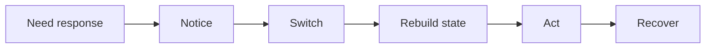
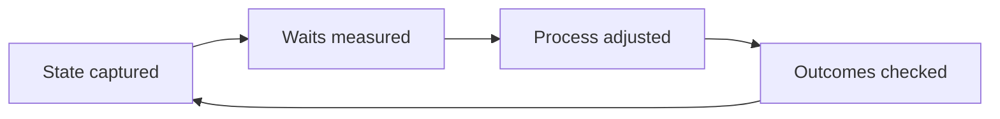

  

    <h1>Work stalls between actions</h1>
    

      Pickup and continuation lag far behind code generation.
    

    

      wait states
      handoff cost
      task state
      pipeline latency
    

  

  

    <ul class="mini-list">
      <li>Handoffs create chains of waiting.</li>
      <li>The cost is reorientation and recovery.</li>
      <li>Explicit state makes the stall measurable.</li>
    </ul>
  

---

  
Delay pattern

  <h2>One interrupt costs five transitions</h2>
  <ul class="tight-list">
    <li>A five-minute question burns 30+ minutes of switching.</li>
    <li>Each step — notice, switch, rebuild, act, recover — has its own latency.</li>
    <li>Repeated interrupts multiply non-linearly across the queue.</li>
  </ul>

---

  

    
Handoff cost

    <h2>Every handoff forces a discovery round</h2>
    <ul class="tight-list">
      <li>Reconstruct what changed.</li>
      <li>Provide context sufficient to act.</li>
      <li>Confirm owner and blocker.</li>
      <li>Absorb the round-trip cost.</li>
    </ul>
  

  

    
Minimum exchange

    <h2>One handoff, four steps</h2>
    <ul class="tight-list">
      <li>question</li>
      <li>answer</li>
      <li>confirmation</li>
      <li>renewed wait if unclear</li>
    </ul>
  

---

  
Mixed actors

  <h2>Thin state stalls every actor</h2>
  <ul class="tight-list">
    <li>Ambiguous ownership pauses humans.</li>
    <li>Insufficient context halts AI agents.</li>
    <li>Each human↔AI transition is another potential stall.</li>
    <li>More actors accelerate only when state crosses intact.</li>
  </ul>

---

  
Blind spot

  <h2>Git history hides the waiting</h2>
  <ul class="tight-list">
    <li>Commits record output but omit elapsed idle time.</li>
    <li>Review churn buries context-recovery cost.</li>
    <li>CI timestamps miss the gap before someone acts.</li>
    <li>Coordination drag stays invisible to standard tooling.</li>
  </ul>

---

  

    
Observable state

    <h2>Explicit state turns pickup into continuation</h2>
    
If these fields are current, the next actor starts immediately.

  

  

    
State that cuts delay

    <ul class="tight-list">
      <li>current owner</li>
      <li>blocker + unblock condition</li>
      <li>latest decision</li>
      <li>safe next step</li>
    </ul>
  

---

  
Measurement loop

  <h2>Measure waits, change process, verify outcomes</h2>
  <ul class="tight-list">
    <li>Locate which transitions create stalls.</li>
    <li>Test whether a change reduces waiting.</li>
    <li>Confirm quality did not degrade in the process.</li>
  </ul>

---

<h2 class="section-heading-loose">State visibility improves three metrics at once</h2>

  

    
Quality

    <h2>Code quality</h2>
    <ul class="tight-list">
      <li>fewer incorrect resumptions</li>
      <li>cleaner fix loops</li>
      <li>regressions easier to trace</li>
    </ul>
  

  

    
Waiting

    <h2>Human waiting time</h2>
    <ul class="tight-list">
      <li>faster first action</li>
      <li>context already present at pickup</li>
      <li>approval unblocked</li>
    </ul>
  

  

    
Flow

    <h2>Throughput</h2>
    <ul class="tight-list">
      <li>higher flow efficiency</li>
      <li>fewer stalled items</li>
      <li>less coordination drag per merge</li>
    </ul>
  

---

  
Operational sequence

  <h2>Visibility → measurement → automation</h2>
  <ul class="tight-list">
    <li>Record owner, blocker, and next action at every transition.</li>
    <li>Measure how long work sits between actors.</li>
    <li>Automate only where state supports safe continuation.</li>
    <li>Track waiting time and quality together as the scorecard.</li>
  </ul>

