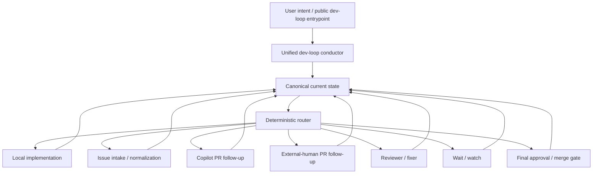

# Public dev-loop contract

This document defines the first-slice contract for issue #86: one public `dev-loop` façade with deterministic routing to internal strategy families.

## Public surface

The single public entrypoint is:

- `dev-loop`

Day-one user-intent forms:

- start dev loop on issue `<n>`
- continue dev loop on PR `<n>`
- start issue `<n>` locally
- start issue `<n>` locally, then continue the loop
- continue the current dev loop
- what state is the dev loop in?

Users should not have to choose `dev-loop` vs `copilot-dev-loop` vs `copilot-autopilot` up front.

## Canonical current state

The public router consumes one canonical current state with these top-level dimensions:

| Field | Meaning |
|---|---|
| `target` | active artifact: `issue` \| `pr` \| `local_branch` \| `local_phase`; issue targets may include `linkedPr` when an existing PR is authoritative |
| `ownership` | durable owner or strategy family currently responsible for the artifact: `local` \| `copilot` \| `external_human` \| `reviewer` \| `maintainer` \| `user` |
| `nextActor` | immediate actor expected to take the next step; it may differ from `ownership` during review, approval, or handoff states |
| `status` | `active` \| `waiting` \| `blocked` \| `approval_ready` \| `merge_ready` \| `done` |
| `authorization` | `authorized` \| `needs_confirmation` \| `not_authorized` |

The authoritative first-slice evaluator is:

- `packages/core/src/loop/public-dev-loop-routing.mjs`

Authoritative status-report helper:

- `resolveAuthoritativeDevLoopStatus()` in `packages/core/src/loop/public-dev-loop-routing.mjs`

Its tests are:

- `packages/core/test/public-dev-loop-routing.test.mjs`

## Authoritative-state-first status reporting contract

Before answering status/progress/readiness/merge-state/next-step questions, consumers must:

1. resolve the authoritative active artifact identity (issue/PR/branch/phase as applicable)
   - for issue targets, this includes authoritative issue↔PR linkage resolution (for example via timeline linkage detection such as `scripts/github/detect-linked-issue-pr.mjs`)
2. resolve artifact state (`open` \| `closed` \| `merged` \| `not_applicable`)
3. resolve current loop state
4. resolve the next action from routed canonical state

Prior chat context is only a hint, never state authority.

If authoritative identity/state (including issue↔PR linkage when relevant) cannot be resolved confidently, fail closed to reconcile/unknown instead of guessing.

Expected answer shape (field names may vary by surface, but semantics must match):

```text
Active issue: <owner/repo>#<n> (when applicable)
Active PR: <owner/repo>#<n> (when applicable)
Artifact state: open|closed|merged|not_applicable
Loop state: <resolved loop state>
Next action: <resolved next action>
```

## Internal strategy families

The public router currently maps to these deterministic internal strategies:

| Strategy | Used for | Compatibility entrypoint |
|---|---|---|
| `local_implementation` | local branch/phase work and explicit local starts | `dev-loop` |
| `issue_intake` | issue-first normalization/intake before PR follow-up | `copilot-autopilot` |
| `copilot_pr_followup` | Copilot-owned PR follow-up | `copilot-dev-loop` |
| `external_pr_followup` | external-human contributor PR follow-up | none |
| `reviewer_fixer` | reviewer/fixer passes on the current PR | none |
| `wait_watch` | waiting/watch states | `dev-loop` or `copilot-dev-loop`, depending on ownership |
| `final_approval` | approval-ready or merge-ready gate | none |

The compatibility entrypoints remain available during migration, but they are no longer the primary public UX.

## Deterministic routing summary

First-match-wins routing posture:

1. blocked or not-authorized state -> stop and ask for a human decision
2. done -> terminal stop
3. approval-ready / merge-ready -> `final_approval`
4. waiting -> `wait_watch`
5. local branch / local phase -> `local_implementation`
6. issue target with `linkedPr` -> route as the linked PR with the same ownership/actor state
7. issue target without `linkedPr` -> `issue_intake`
8. PR owned by external human -> `external_pr_followup`
9. PR owned by reviewer or next actor reviewer -> `reviewer_fixer`
10. PR owned by Copilot -> `copilot_pr_followup`
11. anything else -> fail closed to `needs_reconcile`

## Internal / external model



## Compatibility and migration posture

- `dev-loop` is the public façade going forward.
- `copilot-dev-loop` and `copilot-autopilot` stay available as compatibility/internal strategy entrypoints in this slice.
- Documentation and examples should lead with `dev-loop` and explain routed behavior.
- Compatibility entrypoints can be deprecated only after the public façade is proven and documented well enough.

## Non-goals for this slice

- deleting `copilot-dev-loop` or `copilot-autopilot`
- flattening actor/ownership differences between local, Copilot, reviewer, maintainer, and external-human paths
- replacing existing lower-level state machines with prompt-only branching
- wiring every runtime helper through this façade in one change
- broad UI work outside the public workflow/API unification

## Example mappings

| User intent | Canonical state / route |
|---|---|
| start dev loop on issue `86` with no linked PR | synthesize issue target -> `issue_intake` -> compatibility `copilot-autopilot` |
| start dev loop on issue `86` with linked PR `88` and Copilot ownership | issue target + `linkedPr=88` -> route as PR `88` -> `copilot_pr_followup` -> compatibility `copilot-dev-loop` |
| continue dev loop on PR `88` with Copilot ownership | PR target + `ownership=copilot` -> `copilot_pr_followup` -> compatibility `copilot-dev-loop` |
| start issue `86` locally, then continue the loop | local phase slice for issue `86` -> `local_implementation`, then resume via public `dev-loop` against the updated state |
| continue the current dev loop while waiting | same target + `status=waiting` -> `wait_watch` |
| what state is the dev loop in? | inspect the canonical state and report the routed internal strategy without switching public entrypoints |
