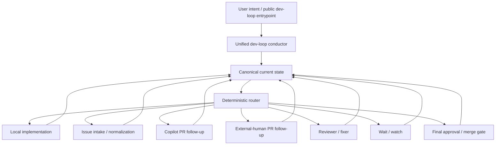

# Public dev-loop contract

This document defines the first-slice contract for issue #86: one public `dev-loop` façade with deterministic routing to internal strategy families.

## Public surface

The single public entrypoint is:

- `dev-loop`

It should be callable from the user-facing workflow surfaces, including:

- `subagent dev-loop`
- `/skill:dev-loop`

Day-one user-intent forms:

- start dev loop on issue `<n>`
- continue dev loop on PR `<n>`
- start issue `<n>` locally
- start issue `<n>` locally, then continue the loop
- continue the current dev loop
- auto dev loop (durable auto ownership over the detected routed loop)
- what state is the dev loop in?

Users should not have to choose `dev-loop` vs `copilot-dev-loop` vs `copilot-autopilot` up front.

## Workflow-surface taxonomy and guardrails

Use this taxonomy consistently across docs, discovery surfaces, and tests:

| Surface class | Entrypoints | Guardrail |
|---|---|---|
| Public workflow entrypoint | `dev-loop` | treat as the default and converging public workflow surface |
| Temporary internal strategy seams | `copilot-dev-loop`, `copilot-autopilot` | keep only as routed transitional seams for now; deprecate them from the intended public surface and do not present them as equal first-choice workflows |
| Reusable role agents | `coordinator`, `developer`, `docs`, `review`, `fixer`, `quality`, `refiner` | keep framed as reusable building blocks, not peer public workflow entrypoints |

These internal seams are temporary. Keep them only until their routed behavior is absorbed by the single public `dev-loop` entrypoint and its bounded API/parameter surface.

Regression tests must fail if this taxonomy drifts in wording or surfaced entrypoint assets.

## Canonical current state

The public router consumes one canonical current state with these top-level dimensions:

| Field | Meaning |
|---|---|
| `target` | active artifact: `issue` \| `pr` \| `local_branch` \| `local_phase`; issue targets may include `linkedPr` when an existing PR is authoritative |
| `ownership` | durable owner or strategy family currently responsible for the artifact: `local` \| `copilot` \| `external_human` \| `reviewer` \| `maintainer` \| `user` |
| `nextActor` | immediate actor expected to take the next step; it may differ from `ownership` during review, approval, or handoff states |
| `status` | `active` \| `waiting` \| `blocked` \| `approval_ready` \| `merge_ready` \| `done` |
| `authorization` | `authorized` \| `needs_confirmation` \| `not_authorized` |

The authoritative first-slice evaluator is:

- `packages/core/src/loop/public-dev-loop-routing.mjs`

Authoritative status-report helper:

- `resolveAuthoritativeDevLoopStatus()` in `packages/core/src/loop/public-dev-loop-routing.mjs`

Authoritative startup/resume bundle helper:

- `resolveAuthoritativeStartupResumeBundle()` in `packages/core/src/loop/public-dev-loop-routing.mjs`

Its tests are:

- `packages/core/test/public-dev-loop-routing.test.mjs`

## Authoritative-state-first status reporting contract

Before answering status/progress/readiness/merge-state/next-step questions, consumers must:

1. resolve the authoritative active artifact identity (issue/PR/branch/phase as applicable)
   - for issue targets, this includes authoritative issue↔PR linkage resolution (for example via timeline linkage detection such as `scripts/github/detect-linked-issue-pr.mjs`)
2. resolve artifact state (`open` \| `closed` \| `merged` \| `not_applicable`)
3. resolve current loop state
4. resolve the next action from routed canonical state

Prior chat context is only a hint, never state authority.

If authoritative identity/state (including issue↔PR linkage when relevant) cannot be resolved confidently, fail closed to reconcile/unknown instead of guessing.

## Authoritative startup/resume bundle contract

Fresh-session `continue`, `inspect`, and status-style paths should compose one bounded authoritative startup/resume bundle from the existing routing/status contract fields.

An optional public `intent` may be supplied when the caller needs the bundle to preserve `inspect_state` semantics without re-deriving them in a separate layer.

Required authoritative inputs:

- `currentState` (`target`, `ownership`, `nextActor`, `status`, `authorization`)
- optional `intent`
  - when present, it must be a valid public `dev-loop` intent
  - `inspect_state` preserves the bundle's `inspect` route kind and inspect-style next action
- `issueLinkageResolution` (`resolved_linked_pr` \| `resolved_no_open_pr` \| `not_applicable`)
  - required when `currentState.target.kind === issue`
- `artifactState` (`open` \| `closed` \| `merged` \| `not_applicable`)
- explicit resolved `loopState` (`unknown` is not authoritative input)

Resolved bundle output shape:

```json
{
  "bundleKind": "resolved | needs_reconcile",
  "activeArtifact": {
    "kind": "issue | pr | local_branch | local_phase",
    "issue": 111,
    "pr": null,
    "branch": null,
    "phase": null
  },
  "artifactState": "open | closed | merged | not_applicable",
  "issueLinkageResolution": "resolved_linked_pr | resolved_no_open_pr | not_applicable",
  "canonicalState": {
    "target": { "kind": "..." },
    "ownership": "...",
    "nextActor": "...",
    "status": "...",
    "authorization": "..."
  },
  "loopState": "...",
  "routeKind": "route | wait | stop | inspect | needs_reconcile",
  "selectedGate": "...",
  "selectedStrategy": "...",
  "compatibilityEntrypoint": "...",
  "nextAction": "...",
  "reason": "..."
}
```

Fail-closed semantics:

- incomplete/invalid/conflicting startup inputs return:
  - `bundleKind = needs_reconcile`
  - `routeKind = needs_reconcile`
  - `selectedStrategy = none`
  - `compatibilityEntrypoint = none`
  - `loopState = unknown`
  - `nextAction` must instruct reconciliation before routing/status answers
- invalid explicit `intent` also fails closed
- do not introduce additional public degraded states for this slice

Expected answer shape (field names may vary by surface, but semantics must match):

```text
Active issue: <owner/repo>#<n> (when applicable)
Active PR: <owner/repo>#<n> (when applicable)
Artifact state: open|closed|merged|not_applicable
Loop state: <resolved loop state>
Next action: <resolved next action>
```

## Internal strategy families

The public router currently maps to these deterministic internal strategies:

| Strategy | Used for | Compatibility entrypoint |
|---|---|---|
| `local_implementation` | local branch/phase work and explicit local starts | `dev-loop` |
| `issue_intake` | issue-first normalization/intake before PR follow-up | `copilot-autopilot` |
| `copilot_pr_followup` | Copilot-owned PR follow-up | `copilot-dev-loop` |
| `external_pr_followup` | external-human contributor PR follow-up | none |
| `reviewer_fixer` | reviewer/fixer passes on the current PR | none |
| `wait_watch` | waiting/watch states | `dev-loop` or `copilot-dev-loop`, depending on ownership |
| `final_approval` | approval-ready or merge-ready gate | none |

The compatibility entrypoints remain available during migration, but they are no longer the primary public UX.

## Authoritative gate contract

Authoritative route selection is a two-step boundary for this slice:

1. resolve one authoritative canonical current state
2. map that state to one explicit gate, then to the corresponding route/strategy outcome

The shared machine-checkable gate contract is exported from `packages/core/src/loop/public-dev-loop-routing.mjs` as `DEV_LOOP_GATE` and `PUBLIC_DEV_LOOP_GATE_CONTRACT`.

| Gate | Route kind | Strategy | Meaning |
|---|---|---|---|
| `stop_blocked_or_not_authorized` | `stop` | none | blocked or not-authorized canonical state stops for a human decision |
| `stop_done_terminal` | `stop` | none | done canonical state stops as terminal work |
| `final_approval` | `route` | `final_approval` | approval-ready or merge-ready canonical state routes to the final approval gate |
| `wait_watch` | `wait` | `wait_watch` | waiting canonical state routes to the shared wait/watch strategy |
| `local_implementation` | `route` | `local_implementation` | local branch or local phase canonical state stays on local implementation |
| `issue_intake` | `route` | `issue_intake` | issue canonical state without a linked PR routes to issue intake |
| `external_pr_followup` | `route` | `external_pr_followup` | external-human PR ownership routes to external PR follow-up |
| `reviewer_fixer` | `route` | `reviewer_fixer` | reviewer-owned or reviewer-next PR state routes to reviewer/fixer |
| `copilot_pr_followup` | `route` | `copilot_pr_followup` | Copilot-owned PR state routes to Copilot PR follow-up |
| `fail_closed_reconcile` | `needs_reconcile` | none | ambiguous, conflicting, or unsupported canonical state fails closed to reconcile |

For issue targets, authoritative issue↔PR linkage resolution remains part of state resolution before claiming there is no open linked PR:

- when canonical issue state includes `linkedPr`, route selection first uses that linked PR as the authoritative routable artifact
- when canonical issue state does **not** include `linkedPr`, status/reporting consumers must still require explicit authoritative linkage resolution before asserting there is no open linked PR

## Deterministic routing order

First-match-wins routing posture:

1. blocked or not-authorized state -> stop and ask for a human decision
2. done -> terminal stop
3. approval-ready / merge-ready -> `final_approval`
4. waiting -> `wait_watch`
5. local branch / local phase -> `local_implementation`
6. issue target with `linkedPr` -> route as the linked PR with the same ownership/actor state
7. issue target without `linkedPr` -> `issue_intake`
8. PR owned by external human -> `external_pr_followup`
9. PR owned by reviewer or next actor reviewer -> `reviewer_fixer`
10. PR owned by Copilot -> `copilot_pr_followup`
11. anything else -> fail closed to `needs_reconcile`

## `auto dev loop` durable auto contract

When the public intent is `auto dev loop`, the router must:

1. require canonical current state resolution first
2. route to the same detected internal strategy as normal state-based routing
3. mark execution mode as durable auto ownership (`durable_auto`)
4. keep waiting/watch states in healthy-wait semantics (`auto_healthy_wait`)

In healthy waiting states, quiet watcher observations (for example `timeout` or `idle`) are observational only and must not be surfaced as attention by themselves. Escalation is still expected for true blocked/authorization/reconcile/action-required states.

## Internal / external model



## Single-entrypoint convergence posture

- `dev-loop` is the only intended public workflow entrypoint.
- `copilot-dev-loop` and `copilot-autopilot` are temporary internal seams kept only until the cleanup/convergence work lands; this slice does not remove them yet.
- Documentation and examples should lead with `dev-loop` and explain routed behavior.
- Almost all workflow branching should converge into deterministic state-machine/tooling surfaces behind `dev-loop`.
- User-visible variation should be expressed through the external `dev-loop` API / bounded parameters or settings, not by preserving multiple public workflow names.

## Bounded variation parameter contract

Supported workflow variations are expressed as `dev-loop` API parameters or settings rather than as new public workflow names.
Parameters may **steer** `dev-loop`, but must not replace authoritative routing.

### Precedence order (highest → lowest)

1. **Authoritative current state** — primary source of truth for what artifact/state the loop is actually in
2. **Explicit user intent / API parameters** — may choose among supported variation modes for the same public entrypoint
3. **Settings / preferences** — provide defaults only when explicit intent/parameters have not decided

Any conflict that would materially change artifact identity, ownership truth, or gate classification **fails closed** rather than being silently resolved by a parameter or preference.

### First-slice allowed parameters

| Parameter | Allowed values | Behavior |
|---|---|---|
| `mode` | `bounded_handoff` (default) \| `durable_auto` | Steers execution mode; `durable_auto` equivalent to `auto_continue_current` semantics |
| `watch` | boolean | Explicitly request wait/watch semantics; fails closed if routed state is not wait-capable |
| `intent` | any existing public `dev-loop` intent | Disambiguates the supported public intent; maps to existing contract values |
| `targetPreference` | `prefer_github_first` (default) \| `prefer_local` | Steers routing preference; must not override authoritative linked-PR or active-artifact truth |

The bounded allow-list is exported from `packages/core/src/loop/public-dev-loop-routing.mjs` as `DEV_LOOP_VARIATION_PARAMETER_CONTRACT`.

### Explicit non-parameters for this slice

These must **not** become public variation knobs:
- arbitrary ownership override for an already-resolved canonical state
- arbitrary strategy override (e.g. "force copilot-dev-loop")
- arbitrary gate override (e.g. "skip approval gate")
- issue↔PR linkage bypass
- free-form "expert mode" flags that bypass deterministic routing

### Fail-closed rules

The following parameter/state combinations fail closed to `needs_reconcile` instead of silently coercing:

| Conflict | Reason |
|---|---|
| `mode=bounded_handoff` + `intent=auto_continue_current` | `auto_continue_current` always requires durable auto execution mode |
| Unrecognized `mode` value | Value not on the bounded allow-list |
| Unrecognized `targetPreference` value | Value not on the bounded allow-list |
| `watch=true` when the routed result is not wait/watch-eligible | Watch semantics require a `wait_watch` gate |
| Non-boolean `watch` value | Value is outside the bounded boolean allow-list and must fail closed |
| `targetPreference=prefer_local` when authoritative state has a linked PR or active PR artifact | Preference must not override authoritative linked-PR truth |
| `mode=durable_auto` without authoritative current state | Durable auto requires authoritative current state to route from |

### Representative translations: name-shaped intent → parameterized `dev-loop` form

| Formerly name-shaped or prose-shaped | Parameterized single-entrypoint form |
|---|---|
| "auto dev loop" | `dev-loop --intent continue_current --mode durable_auto` |
| "run dev loop on PR 88 and stay on it" | `dev-loop --intent continue_on_pr --target pr:88 --watch` |
| "prefer the local path for issue 42" | `dev-loop --intent start_on_issue --target issue:42 --target-preference prefer_local` |
| "just inspect current state" | `dev-loop --intent inspect_state` |

These are parameterized uses of `dev-loop`, not new workflow-facing entrypoints.

## Non-goals for this slice

- deleting `copilot-dev-loop` or `copilot-autopilot` in this one PR
- flattening actor/ownership differences between local, Copilot, reviewer, maintainer, and external-human paths
- replacing existing lower-level state machines with prompt-only branching
- wiring every runtime helper through this façade in one change
- broad UI work outside the public workflow/API unification

## Example mappings

| User intent | Canonical state / route |
|---|---|
| start dev loop on issue `86` with no linked PR | synthesize issue target -> `issue_intake` -> current internal seam `copilot-autopilot` |
| start dev loop on issue `86` with linked PR `88` and Copilot ownership | issue target + `linkedPr=88` -> route as PR `88` -> `copilot_pr_followup` -> current internal seam `copilot-dev-loop` |
| continue dev loop on PR `88` with Copilot ownership | PR target + `ownership=copilot` -> `copilot_pr_followup` -> current internal seam `copilot-dev-loop` |
| start issue `86` locally, then continue the loop | local phase slice for issue `86` -> `local_implementation`, then resume via public `dev-loop` against the updated state |
| continue the current dev loop while waiting | same target + `status=waiting` -> `wait_watch` |
| what state is the dev loop in? | inspect the canonical state and report the routed internal strategy without switching public entrypoints |
