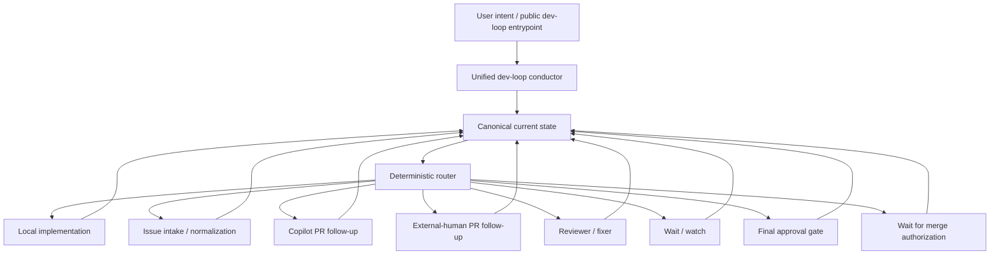

# Public dev-loop contract

This document is the canonical authority for the public `dev-loop` entrypoint, its routed semantics, accepted shorthand, and the rule that internal strategy names stay behind that public façade.

Other repo docs may summarize or link this contract, but they should not redefine it.

## Public surface

The single public entrypoint is:

- `dev-loop`

It should be callable from the user-facing workflow surfaces, including:

- `subagent dev-loop`
- `/skill:dev-loop`

Day-one user-intent forms:

- start dev loop on issue `<n>`
- continue dev loop on PR `<n>`
- start issue `<n>` locally
- start issue `<n>` locally, then continue the loop
- continue the current dev loop
- auto dev loop (durable auto ownership over the detected routed loop)
- auto dev loop on issue `<n>`
- what state is the dev loop in?

Users should not have to choose `dev-loop` vs internal seam names up front.

## Issue-based shorthand auto trigger contract

This shorthand form is explicitly accepted and resolves to the same bounded public `dev-loop` intent:

- `auto dev loop on issue 112`

Canonical mapping:

| Shorthand phrase | Canonical public intent |
|---|---|
| `auto dev loop on issue 112` | `dev-loop --intent auto_continue_current` with authoritative current state targeting issue 112 |

Stop-boundary contract for this shorthand:

1. continue through the normal GitHub/Copilot loop (assignment, PR watch, draft review/fix, Copilot review/fix, and final pre-approval work) unless a genuine stop condition is reached
2. stop at the final human approval decision by default
3. after formal approval, stop again in `waiting_for_merge_authorization` unless merge authorization is explicitly granted for the active issue/PR scope
4. merge only after explicit merge authorization for the active issue/PR scope

## Surfaced-UX deprecation readiness bar

Do not remove surfaced internal loop names until all of the following are true:

1. authoritative routing is explicit and test-backed
2. fresh-session startup/resume/status can route from the bounded authoritative startup bundle
3. former name-shaped variation pressure has a bounded `dev-loop` parameter/settings home
4. surfaced help/discovery/readiness paths already point users to `dev-loop` and supported routed/parameterized forms

Once that bar is met:

- `dev-loop` remains the only intended visible workflow entrypoint in surfaced UX
- internal seam names are removed from surfaced workflow-choice phrasing
- any remaining seam use stays explicitly internal/runtime-only

## Workflow-surface taxonomy and guardrails

Use this taxonomy consistently across docs, discovery surfaces, and tests:

| Surface class | Entrypoints | Guardrail |
|---|---|---|
| Public workflow entrypoint | `dev-loop` | treat as the default and converging public workflow surface |
| Internal routed strategy modules | `copilot-dev-loop` logic | keep internal-only behind `dev-loop`; do not expose as executable peer workflow entrypoints |
| Reusable role agents | `coordinator`, `developer`, `docs`, `review`, `fixer`, `quality`, `refiner` | keep framed as reusable building blocks, not peer public workflow entrypoints |

Any remaining specialized Copilot behavior stays internal-only behind `dev-loop`.

Regression tests must fail if this taxonomy drifts in wording or surfaced entrypoint assets.

## Canonical current state

The public router consumes one canonical current state with these top-level dimensions:

| Field | Meaning |
|---|---|
| `target` | active artifact: `issue` \| `pr` \| `local_branch` \| `local_phase`; issue targets may include `linkedPr` when an existing PR is authoritative |
| `ownership` | durable owner or strategy family currently responsible for the artifact: `local` \| `copilot` \| `external_human` \| `reviewer` \| `maintainer` \| `user` |
| `nextActor` | immediate actor expected to take the next step; it may differ from `ownership` during review, approval, or handoff states |
| `status` | `active` \| `waiting` \| `blocked` \| `approval_ready` \| `merge_ready` \| `done` |
| `authorization` | `authorized` \| `needs_confirmation` \| `not_authorized` |

The authoritative first-slice evaluator is:

- `packages/core/src/loop/public-dev-loop-routing.mjs`

Authoritative status-report helper:

- `resolveAuthoritativeDevLoopStatus()` in `packages/core/src/loop/public-dev-loop-routing.mjs`

Authoritative startup/resume bundle helper:

- `resolveAuthoritativeStartupResumeBundle()` in `packages/core/src/loop/public-dev-loop-routing.mjs`

Its tests are:

- `packages/core/test/public-dev-loop-routing.test.mjs`

## Authoritative-state-first status reporting contract

Before answering status/progress/readiness/merge-state/next-step questions, consumers must:

1. resolve the authoritative active artifact identity (issue/PR/branch/phase as applicable)
   - for issue targets, this includes authoritative issue↔PR linkage resolution (for example via timeline linkage detection such as `scripts/github/detect-linked-issue-pr.mjs`)
2. resolve artifact state (`open` \| `closed` \| `merged` \| `not_applicable`)
3. resolve current loop state
4. resolve the next action from routed canonical state

Prior chat context is only a hint, never state authority.

If authoritative identity/state (including issue↔PR linkage when relevant) cannot be resolved confidently, fail closed to reconcile/unknown instead of guessing.
For async/durable-auto flows, do not claim that `dev-loop` has started or is running unless a visible Pi-managed async run id has also been resolved.

When the routed next step requires confirmation for a mutation, the status/startup next action should name that concrete pending mutation (for example issue assignment to `copilot-swe-agent`) instead of generic "approval gate" wording.

## Authoritative startup/resume bundle contract

Fresh-session `continue`, `inspect`, and status-style paths should compose one bounded authoritative startup/resume bundle from the existing routing/status contract fields.

An optional public `intent` may be supplied when the caller needs the bundle to preserve `inspect_state` semantics without re-deriving them in a separate layer.

Required authoritative inputs:

- `currentState` (`target`, `ownership`, `nextActor`, `status`, `authorization`)
- optional `intent`
  - when present, it must be a valid public `dev-loop` intent
  - `inspect_state` preserves the bundle's `inspect` route kind and inspect-style next action
- optional `mode` (`bounded_handoff` \| `durable_auto`)
  - same bounded variation-mode semantics as `evaluatePublicDevLoopRouting`
  - `auto_continue_current` always resolves to `durable_auto`
- `issueLinkageResolution` (`resolved_linked_pr` \| `resolved_no_open_pr` \| `not_applicable`)
  - required when `currentState.target.kind === issue`
- `issueReadiness` (`ready` \| `needs_clarification` \| `not_applicable`)
  - required for Copilot-first issue targets with `issueLinkageResolution=resolved_no_open_pr`
- `issueAssignmentState` (`unassigned` \| `assigned_to_copilot` \| `not_applicable`)
  - required for Copilot-first issue targets with `issueLinkageResolution=resolved_no_open_pr`
- `artifactState` (`open` \| `closed` \| `merged` \| `not_applicable`)
- explicit resolved `loopState` (`unknown` is not authoritative input)
- required for async/durable-auto startup or status paths: `asyncRun`
  - shape: `{ "kind": "pi_managed_run" | "detached_process", "runId": "<visible-run-id>" | null, "processId": 12345 | null, "visible": true|false, "inspectionState"?: "visible" | "hidden" | "stale" | "uninspectable" | "missing" }`
  - durable-auto success requires `kind=pi_managed_run`, a non-empty visible `runId`, and `visible=true`
  - when `inspectionState` is provided as `hidden`, `stale`, or `uninspectable`, durable-auto must fail closed with that state surfaced in diagnostics
  - detached local processes are diagnostic-only evidence and must fail closed instead of being treated as a successful async start
- when refreshed loop state is `linked_pr_ready_for_followup` for an issue target with a resolved linked PR, startup/resume and status resolution must promote stale bootstrap waiting to the linked PR follow-up path (or fail closed if the linked-PR facts are incomplete/contradictory) instead of preserving the old bootstrap wait route

Resolved bundle output shape:

```json
{
  "bundleKind": "resolved | needs_reconcile",
  "activeArtifact": {
    "kind": "issue | pr | local_branch | local_phase",
    "issue": 111,
    "pr": null,
    "branch": null,
    "phase": null
  },
  "artifactState": "open | closed | merged | not_applicable",
  "issueLinkageResolution": "resolved_linked_pr | resolved_no_open_pr | not_applicable",
  "issueAssignmentSeam": "needs_refinement | ready_needs_assignment_confirmation | ready_assign_now | assigned_to_copilot | not_applicable",
  "canonicalState": {
    "target": { "kind": "..." },
    "ownership": "...",
    "nextActor": "...",
    "status": "...",
    "authorization": "..."
  },
  "loopState": "...",
  "routeKind": "route | wait | stop | inspect | needs_reconcile",
  "selectedGate": "...",
  "selectedStrategy": "...",
  "executionMode": "bounded_handoff | durable_auto",
  "waitSemantics": "default | auto_healthy_wait",
  "asyncRun": {
    "kind": "pi_managed_run",
    "runId": "run-186",
    "processId": null,
    "visible": true
  },
  "nextAction": "...",
  "reason": "..."
}
```

Fail-closed semantics:

- incomplete/invalid/conflicting startup inputs return:
  - `bundleKind = needs_reconcile`
  - `routeKind = needs_reconcile`
  - `selectedStrategy = none`
  - `loopState = unknown`
  - `nextAction` must instruct reconciliation before routing/status answers
- `executionMode=durable_auto` must fail closed unless a visible Pi-managed async run is already registered
- a detached watcher/background pid is never acceptable evidence of async `dev-loop` startup success
- invalid explicit `intent` also fails closed
- do not introduce additional public degraded states for this slice

Expected answer shape (field names may vary by surface, but semantics must match):

```text
Active issue: <owner/repo>#<n> (when applicable)
Active PR: <owner/repo>#<n> (when applicable)
Artifact state: open|closed|merged|not_applicable
Loop state: <resolved loop state>
Async run: <visible Pi-managed run id>|unknown
Next action: <resolved next action>
```

## Internal strategy families

The public router currently maps to these deterministic internal strategies:

| Strategy | Used for | Public workflow entrypoint exposure |
|---|---|---|
| `local_implementation` | local branch/phase work and explicit local starts | `dev-loop` |
| `issue_intake` | issue-first normalization/intake before PR follow-up | none (internal-only via `dev-loop` routing) |
| `copilot_pr_followup` | Copilot-owned PR follow-up | none (internal-only via `dev-loop` routing) |
| `external_pr_followup` | external-human contributor PR follow-up | none |
| `reviewer_fixer` | reviewer/fixer passes on the current PR | none |
| `wait_watch` | waiting/watch states | `dev-loop` |
| `final_approval` | approval-ready gate, or merge-ready with explicit merge authorization | none |

`waiting_for_merge_authorization` is part of the gate contract below as a stop gate rather than an internal strategy.

Internal strategy naming is implementation detail; normal orchestration always starts from `dev-loop`.

## Copilot-first issue-assignment seam (unassigned issues)

For Copilot-first issue flows (`currentState.target.kind=issue`, `ownership=copilot`, and no linked PR), orchestration must resolve this seam from authoritative issue facts before follow-up routing:

1. `issueReadiness=needs_clarification` → ask clarification questions and stop before assignment (`issueAssignmentSeam=needs_refinement`)
2. `issueReadiness=ready` + `issueAssignmentState=unassigned` + `authorization=needs_confirmation` → ask for explicit assignment confirmation (`issueAssignmentSeam=ready_needs_assignment_confirmation`)
3. `issueReadiness=ready` + `issueAssignmentState=unassigned` + `authorization=authorized` → assign `copilot-swe-agent` now before PR/bootstrap/watch follow-up (`issueAssignmentSeam=ready_assign_now`)
4. `issueReadiness=ready` + `issueAssignmentState=assigned_to_copilot` → assignment seam satisfied; proceed to follow-up (`issueAssignmentSeam=assigned_to_copilot`)

Fail closed if those readiness/assignment facts are missing or invalid.

## Authoritative gate contract

Authoritative route selection is a two-step boundary for this slice:

1. resolve one authoritative canonical current state
2. map that state to one explicit gate, then to the corresponding route/strategy outcome

The shared machine-checkable gate contract is exported from `packages/core/src/loop/public-dev-loop-routing.mjs` as `DEV_LOOP_GATE` and `PUBLIC_DEV_LOOP_GATE_CONTRACT`.

| Gate | Route kind | Strategy | Meaning |
|---|---|---|---|
| `stop_blocked_or_not_authorized` | `stop` | none | blocked or not-authorized canonical state stops for a human decision |
| `stop_done_terminal` | `stop` | none | done canonical state stops as terminal work |
| `final_approval` | `route` | `final_approval` | approval-ready canonical state routes to the final approval gate; merge-ready routes here only when merge authorization is explicit |
| `waiting_for_merge_authorization` | `stop` | none | merge-ready canonical state without explicit merge authorization stops and waits for explicit merge authorization |
| `wait_watch` | `wait` | `wait_watch` | waiting canonical state routes to the shared wait/watch strategy |
| `local_implementation` | `route` | `local_implementation` | local branch or local phase canonical state stays on local implementation |
| `issue_intake` | `route` | `issue_intake` | issue canonical state without a linked PR routes to issue intake |
| `external_pr_followup` | `route` | `external_pr_followup` | external-human PR ownership routes to external PR follow-up |
| `reviewer_fixer` | `route` | `reviewer_fixer` | reviewer-owned or reviewer-next PR state routes to reviewer/fixer |
| `copilot_pr_followup` | `route` | `copilot_pr_followup` | Copilot-owned PR state routes to Copilot PR follow-up |
| `fail_closed_reconcile` | `needs_reconcile` | none | ambiguous, conflicting, or unsupported canonical state fails closed to reconcile |

For issue targets, authoritative issue↔PR linkage resolution remains part of state resolution before claiming there is no open linked PR:

- when canonical issue state includes `linkedPr`, route selection first uses that linked PR as the authoritative routable artifact
- when canonical issue state does **not** include `linkedPr`, status/reporting consumers must still require explicit authoritative linkage resolution before asserting there is no open linked PR

## Deterministic routing order

First-match-wins routing posture:

1. blocked or not-authorized state -> stop and ask for a human decision
2. done -> terminal stop
3. merge-ready + `authorization=needs_confirmation` -> `waiting_for_merge_authorization`
4. approval-ready, or merge-ready + `authorization=authorized` -> `final_approval`
5. waiting -> `wait_watch`
6. local branch / local phase -> `local_implementation`
7. issue target with `linkedPr` -> route as the linked PR with the same ownership/actor state
8. issue target without `linkedPr` -> `issue_intake`
9. PR owned by external human -> `external_pr_followup`
10. PR owned by reviewer or next actor reviewer -> `reviewer_fixer`
11. PR owned by Copilot -> `copilot_pr_followup`
12. anything else -> fail closed to `needs_reconcile`

## `auto dev loop` durable auto contract

When the public intent is `auto dev loop`, the router must:

1. require canonical current state resolution first
2. route to the same detected internal strategy as normal state-based routing
3. mark execution mode as durable auto ownership (`durable_auto`)
4. keep waiting/watch states in healthy-wait semantics (`auto_healthy_wait`)

In healthy waiting states, quiet watcher observations (for example `timeout` or `idle`) are observational only and must not be surfaced as attention by themselves. Escalation is still expected for true blocked/authorization/reconcile/action-required states.

For the Copilot-first bootstrap seam (`waiting_for_initial_copilot_implementation`), durable-auto ownership must route to the dedicated `watch-initial-copilot-pr.mjs` watcher with its default 1-hour watch budget. Quiet/no-activity observations alone do not eject durable ownership while refreshed authoritative state still resolves `waiting_for_initial_copilot_implementation`; inspect/status intents may still summarize that state and exit normally.

When that refreshed seam state advances to `linked_pr_ready_for_followup`, durable-auto continuation must re-enter the same linked PR follow-up path. If the follow-up handoff carries `conductorRouting.handoffEnvelope.requiresLocalIsolation=true`, orchestration should continue through an isolated checkout/worktree transition instead of treating that boundary as final completion.

Main conductor orchestration must treat non-terminal follow-up/wait states (for example `waiting_for_copilot_review`) as continuation boundaries rather than clean completion. If an async child exits before the requested stop boundary and continuation is feasible, automatically resume/restart the same PR flow; otherwise surface the concrete blocker.

## Internal / external model



## Single-entrypoint convergence posture

- `dev-loop` is the only intended public workflow entrypoint.
- any remaining specialized Copilot behavior is internal-only and non-user-invocable under the canonical `copilot-dev-loop` routed surface.
- Documentation and examples should lead with `dev-loop` and explain routed behavior.
- Almost all workflow branching should converge into deterministic state-machine/tooling surfaces behind `dev-loop`.
- User-visible variation should be expressed through the external `dev-loop` API / bounded parameters or settings, not by preserving multiple public workflow names or legacy compatibility seams.

## Bounded variation parameter contract

Supported workflow variations are expressed as `dev-loop` API parameters or settings rather than as new public workflow names.
Parameters may **steer** `dev-loop`, but must not replace authoritative routing.

### Precedence order (highest → lowest)

1. **Authoritative current state** — primary source of truth for what artifact/state the loop is actually in
2. **Explicit user intent / API parameters** — may choose among supported variation modes for the same public entrypoint
3. **Settings / preferences** — provide defaults only when explicit intent/parameters have not decided

Any conflict that would materially change artifact identity, ownership truth, or gate classification **fails closed** rather than being silently resolved by a parameter or preference.

### First-slice allowed parameters

| Parameter | Allowed values | Behavior |
|---|---|---|
| `mode` | `bounded_handoff` (default) \| `durable_auto` | Steers execution mode; `durable_auto` uses the same durable-auto execution-mode semantics as `auto_continue_current`, without replacing the selected intent |
| `watch` | boolean | Explicitly request wait/watch semantics; fails closed for otherwise-successful non-wait routed results, while preserving authoritative `stop` and `needs_reconcile` outcomes |
| `intent` | any existing public `dev-loop` intent | Disambiguates the supported public intent; maps to existing contract values |
| `targetPreference` | `prefer_github_first` (default) \| `prefer_local` | Steers routing preference; must not override authoritative linked-PR or active-artifact truth |

The bounded allow-list is exported from `packages/core/src/loop/public-dev-loop-routing.mjs` as `DEV_LOOP_VARIATION_PARAMETER_CONTRACT`.

`issueReadiness` and `issueAssignmentState` are **not** part of that bounded variation-parameter allow-list. They are authoritative issue-state facts used only for the Copilot-first unassigned-issue seam during startup/status/routing resolution.

### Explicit non-parameters for this slice

These must **not** become public variation knobs:
- arbitrary ownership override for an already-resolved canonical state
- arbitrary strategy override (e.g. "force copilot-dev-loop")
- arbitrary gate override (e.g. "skip approval gate")
- issue↔PR linkage bypass
- free-form "expert mode" flags that bypass deterministic routing

### Fail-closed rules

The following parameter/state combinations fail closed to `needs_reconcile` instead of silently coercing:

| Conflict | Reason |
|---|---|
| `mode=bounded_handoff` + `intent=auto_continue_current` | `auto_continue_current` always requires durable auto execution mode |
| Unrecognized `mode` value | Value not on the bounded allow-list |
| Unrecognized `targetPreference` value | Value not on the bounded allow-list |
| `watch=true` when an otherwise-successful routed result is not wait/watch-eligible | Watch semantics require a routed wait result (`routeKind=wait`), not just `selectedGate=wait_watch`; existing `stop` and `needs_reconcile` outcomes stay authoritative |
| Non-boolean `watch` value | Value is outside the bounded boolean allow-list and must fail closed |
| `targetPreference=prefer_local` when authoritative state has a linked PR or active PR artifact | Preference must not override authoritative PR/linked-PR active artifact truth |
| `mode=durable_auto` without authoritative current state | Durable auto requires authoritative current state to route from |

### Representative translations: name-shaped intent → parameterized `dev-loop` form

| Formerly name-shaped or prose-shaped | Parameterized single-entrypoint form |
|---|---|
| "auto dev loop" | `dev-loop --intent continue_current --mode durable_auto` |
| "run dev loop on PR 88 and stay on it" | `dev-loop --intent continue_on_pr --target pr:88 --watch` |
| "prefer the local path for issue 42" | `dev-loop --intent start_on_issue --target issue:42 --target-preference prefer_local` |
| "just inspect current state" | `dev-loop --intent inspect_state` |

These are parameterized uses of `dev-loop`, not new workflow-facing entrypoints.

## Non-goals for this slice

- broad deletion of lower-level helper logic that `dev-loop` still routes to internally
- flattening actor/ownership differences between local, Copilot, reviewer, maintainer, and external-human paths
- replacing existing lower-level state machines with prompt-only branching
- wiring every runtime helper through this façade in one change
- broad UI work outside the public workflow/API unification

## Example mappings

| User intent | Canonical state / route |
|---|---|
| start dev loop on issue `86` with no linked PR | synthesize issue target -> `issue_intake` internal strategy (routed behind `dev-loop`) |
| start dev loop on issue `86` with linked PR `88` and Copilot ownership | issue target + `linkedPr=88` -> route as PR `88` -> `copilot_pr_followup` internal strategy (routed behind `dev-loop`) |
| continue dev loop on PR `88` with Copilot ownership | PR target + `ownership=copilot` -> `copilot_pr_followup` internal strategy (routed behind `dev-loop`) |
| start issue `86` locally, then continue the loop | local phase slice for issue `86` -> `local_implementation`, then resume via public `dev-loop` against the updated state |
| continue the current dev loop while waiting | same target + `status=waiting` -> `wait_watch` |
| what state is the dev loop in? | inspect the canonical state and report the routed internal strategy without switching public entrypoints |
