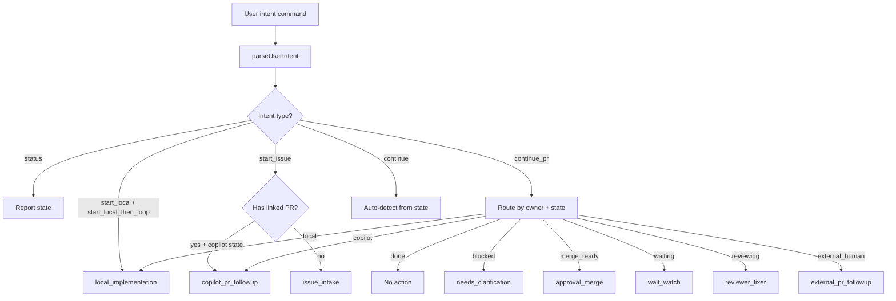

# Unified Dev-Loop Contract

This document defines the **unified dev-loop façade contract**: one public entrypoint with deterministic internal routing to specialized sub-loops.

## Overview

The unified dev-loop provides a single public API surface that routes user intent to the correct internal execution strategy based on deterministic state evaluation. Users no longer need to choose among `dev-loop`, `copilot-dev-loop`, or `copilot-autopilot` up front.

## Public API

### User-intent commands

The public façade accepts natural-language intent commands:

| Command pattern | Intent | Description |
|---|---|---|
| `start dev loop on issue <n>` | `start_issue` | Begin working on an issue |
| `start issue <n> locally` | `start_local` | Implement an issue using the local phase-based path |
| `start issue <n> locally, then continue the loop` | `start_local_then_loop` | Start local, then hand off to the full loop |
| `continue dev loop on PR <n>` | `continue_pr` | Continue an existing PR |
| `continue the current dev loop` | `continue` | Auto-detect and continue what's active |
| `status` / `what state is the dev loop in?` | `status` | Query current state without acting |

### Programmatic API

```javascript
import {
  parseUserIntent,
  resolveCanonicalState,
  routeToStrategy,
  routeFromLegacyEntrypoint,
} from "@pi-dev-loops/core/loop/unified-dev-loop";

// 1. Parse what the user wants
const intent = parseUserIntent("start dev loop on issue #83");
// → { intent: "start_issue", targetNumber: 83, repo: null, raw: "..." }

// 2. Resolve current state from available signals
const state = resolveCanonicalState({
  targetType: "issue",
  targetNumber: 83,
  hasLinkedPR: false,
});

// 3. Route deterministically to an internal strategy
const routing = routeToStrategy({ parsedIntent: intent, canonicalState: state });
// → { strategy: "issue_intake", reason: "...", compatibility: "copilot-autopilot", actionable: true }
```

## Canonical State Model

The routing decision is derived from one authoritative state object:

| Field | Type | Description |
|---|---|---|
| `targetType` | `issue` \| `pr` \| `local_branch` \| `none` | What artifact is active |
| `targetNumber` | `number \| null` | Issue or PR number |
| `repo` | `string \| null` | Repository slug (owner/name) |
| `owner` | `local` \| `copilot` \| `external_human` \| `reviewer` \| `maintainer` \| `unknown` | Who owns the next move |
| `actorState` | `implementing` \| `reviewing` \| `waiting` \| `blocked` \| `approval_ready` \| `merge_ready` \| `done` \| `idle` | What the actor is doing |
| `loopPhase` | `intake` \| `refinement` \| `implementation` \| `review` \| `waiting` \| `approval` \| `merge` \| `done` | High-level phase |
| `copilotState` | `string \| null` | From copilot-loop-state.mjs |
| `reviewerState` | `string \| null` | From reviewer-loop-state.mjs |
| `ownershipState` | `string \| null` | From conductor-ownership.mjs |
| `hasLinkedPR` | `boolean` | Whether the issue has a linked open PR |
| `linkedPRNumber` | `number \| null` | The linked PR number |

## Internal Strategies

The unified façade routes to these internal execution strategies:

| Strategy | Compatibility | Description |
|---|---|---|
| `local_implementation` | `dev-loop` | Local phased implementation |
| `issue_intake` | `copilot-autopilot` | Issue normalization and Copilot assignment |
| `copilot_pr_followup` | `copilot-dev-loop` | Copilot PR watch, review, and fix loop |
| `external_pr_followup` | — | External human contributor PR follow-up |
| `reviewer_fixer` | — | Reviewer-side inner loop |
| `wait_watch` | — | Wait/poll for external events |
| `approval_merge` | — | Final approval and merge gate |
| `needs_clarification` | — | Insufficient info; ask user |

## Routing Logic



## Compatibility and Migration

### Legacy entrypoint support

Existing specialized entrypoints continue to work through `routeFromLegacyEntrypoint()`:

| Old entrypoint | Routes to | Deprecated? |
|---|---|---|
| `dev-loop` | `local_implementation` | Yes (compatibility shim) |
| `copilot-dev-loop` | `copilot_pr_followup` | Yes (compatibility shim) |
| `copilot-autopilot` | `issue_intake` | Yes (compatibility shim) |

### Migration stages

1. **Current (this slice)**: Unified façade introduced alongside existing entrypoints
2. **Next**: Docs and skill triggers shift toward unified commands
3. **Later**: Old public entrypoint names deprecated after unified path is proven
4. **Final**: Old names removed (only after migration is complete)

### What is NOT changing

- Internal loop logic and state machines remain unchanged
- `evaluateConductorRouting` remains the routing authority for PR-level decisions
- `evaluateOwnershipAction` remains the ownership policy authority
- All existing scripts and CLI tools continue to work
- Actor/ownership distinctions are preserved, not flattened

## Relationship to Existing Contracts

| Contract | Relationship |
|---|---|
| `conductor-routing-contract.md` | **Downstream**: unified façade uses conductor routing for PR-level decisions |
| `conductor-ownership-contract.md` | **Upstream**: provides ownership state as an input signal |
| `copilot-loop-state-graph.md` | **Upstream**: provides copilot state as an input signal |
| `reviewer-loop-state-graph.md` | **Upstream**: provides reviewer state as an input signal |

## Implementation

| Component | Location |
|---|---|
| Core unified façade | `packages/core/src/loop/unified-dev-loop.mjs` |
| Core unit tests | `packages/core/test/unified-dev-loop.test.mjs` |
| Package export | `@pi-dev-loops/core/loop/unified-dev-loop` |
| Skill definition | `skills/dev-loop-unified/SKILL.md` |
| This contract | `docs/unified-dev-loop-contract.md` |

## Non-goals

- Deleting existing specialized loops or their internal logic
- Flattening away real actor/ownership differences
- Replacing deterministic helper/state-machine logic with prompt-only orchestration
- Redesigning all workflow helpers in one step
- Broad UI work unrelated to the public loop/API unification
