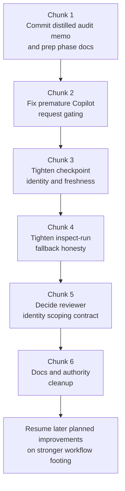

# Workflow remediation preparation

Related issue: #70

## Purpose

This document turns the 2026-05-19 workflow audit into durable repo guidance.

It is a **preparation track** for later improvements, not a roadmap reset.

It exists to harden the current workflow foundation before broader follow-up work proceeds, while keeping the existing planned work intact — especially the bounded Phase 7 second-repo pilot.

## What this does not change

- it does **not** replace `PLAN.md`
- it does **not** replace `docs/phases/phase-7.md`
- it does **not** declare a one-shot workflow rewrite
- it does **not** commit the raw local audit scratch artifacts under `tmp/`, `fanout/`, `fanin/`, `final/`, or `validation/`

## Concrete findings

### 1. Premature Copilot request when CI is effectively unknown
Current behavior can treat a fresh head with no materialized checks as ready for Copilot review.

Primary surfaces:
- `scripts/loop/detect-copilot-loop-state.mjs`
- `packages/core/src/loop/copilot-loop-state.mjs`
- `scripts/loop/copilot-pr-handoff.mjs`
- `test/loop/detect-copilot-loop-state.test.mjs`

Problem shape:
- empty `statusCheckRollup` becomes `ciStatus: "none"`
- only `pending` and `failure` block request flow
- handoff can request Copilot review too early

### 2. Checkpoint identity / freshness is under-scoped
Checkpoint state is not keyed strongly enough and can be reused too loosely.

Primary surfaces:
- `scripts/loop/outer-loop.mjs`
- `scripts/loop/inspect-run.mjs`
- `packages/core/src/loop/run-inspection.mjs`
- `test/loop/outer-loop.test.mjs`
- `test/loop/inspect-run.test.mjs`

Problem shape:
- default checkpoint path is keyed too weakly
- prior checkpoint state can influence later cycles too loosely
- both execution and inspection are affected

### 3. `inspect-run` can over-trust checkpoint-derived fallback
Inspection can present checkpoint-derived state as usable when live detection is unavailable.

Primary surfaces:
- `scripts/loop/inspect-run.mjs`
- `packages/core/src/loop/run-inspection.mjs`
- `scripts/loop/outer-loop.mjs`
- `test/loop/inspect-run.test.mjs`

Problem shape:
- fallback behavior is broader than corrupt JSON handling
- valid-but-stale checkpoint state is also a risk
- this is an operator-signal / output-contract problem

### 4. Reviewer identity scoping is underspecified when `--reviewer-login` is omitted
This is real, but it is not yet a plain bug ticket.

Primary surfaces:
- `scripts/loop/detect-reviewer-loop-state.mjs`
- `scripts/loop/outer-loop.mjs`
- `scripts/loop/inspect-run.mjs`
- `scripts/README.md`
- `docs/reviewer-loop-state-graph.md`

Problem shape:
- omitted reviewer identity broadens scope to all reviewers
- current docs make that behavior at least partly defensible
- this needs a contract decision before any default-behavior change

### 5. Ownership-aware routing exists in core but is not wired into active outer-loop routing
This is a known seam, not a surprise bug.

Primary surfaces:
- `packages/core/src/loop/conductor-routing.mjs`
- `docs/conductor-routing-contract.md`
- `scripts/loop/outer-loop.mjs`

Problem shape:
- ownership-aware routing exists as a core concept
- active outer-loop does not yet consume it
- backlog dedupe should happen before filing any new issue for this

### 6. Docs / authority ownership is still too blurry
This is cleanup work, not the root-cause explanation for the runtime bugs.

Primary surfaces:
- `docs/IMPLEMENTATION_WORKFLOW.md`
- `skills/dev-loop/SKILL.md`
- `scripts/README.md`
- relevant state/contract docs under `docs/`

Problem shape:
- shipped runtime semantics should be code-owned
- some docs still over-own or blur behavior
- this weakens future maintenance and audits

## Implementation chain

## Working rules for chunks

Each follow-up PR should:
- reference `#70`
- stay bounded to one chunk
- include explicit non-goals
- include focused validation
- update docs/contracts only where that chunk changes shipped behavior

## Non-goals

- no one-shot workflow rewrite
- no giant mixed PR
- no premature filing of weakly evidenced watcher/pagination issues
- no treating reviewer-scope omission as a solved bug before deciding the contract
- no pretending one checkpoint-path fix solves every freshness/epoch problem
- no replacing or deleting already-planned work
